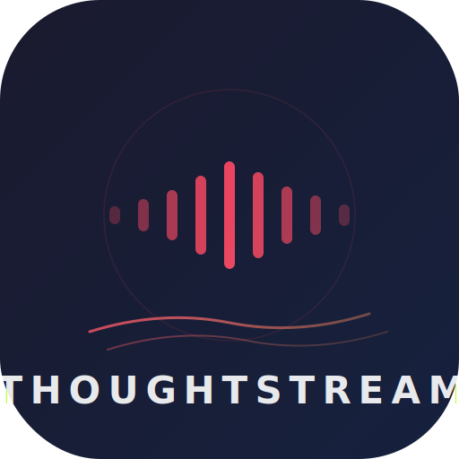

<p align="center">
  
</p>
<p align="center">
  <strong>Hands-free, continuous speech-to-text for iOS.</strong><br/>
  Start with Siri, talk as long as you want, get a clean transcript saved automatically.<br/>
  Built for runners, walkers, and anyone who thinks better out loud.
</p>
<p align="center">
  
  
  
</p>

## Why This Exists
Apple's built-in dictation times out after ~30 seconds of silence. Voice Memos records but doesn't transcribe. ThoughtStream bridges the gap — it listens continuously with no time limit, transcribes in real time, and saves everything as a clean Markdown file when you're done.
**Say "Hey Siri, thought stream" and start talking. That's it.**

## Features
- **Siri Launch** — "Hey Siri, thought stream" opens the app and starts recording immediately
- **Unlimited Duration** — Seamlessly chains recognition requests so you can talk for seconds, minutes, or hours
- **Live Transcript** — See your words appear in real time as you speak
- **On-Device Processing** — Uses Apple's on-device speech recognition when available (no data leaves your phone)
- **Auto-Save** — Transcripts saved as timestamped Markdown files to your Documents folder
- **Background Audio** — Keeps listening even when the screen locks
- **Minimal UI** — Dark interface with a single large button, designed for glanceable use while moving

## How It Works

### Starting a Stream
**Option 1: Siri (hands-free)**
> "Hey Siri, thought stream"

The app opens and immediately begins listening. No taps needed.

**Option 2: Manual**
Open the app and tap the red record button.

### During a Stream
Just talk. The transcript scrolls in real time on screen. A pulsing red dot and elapsed timer show that recording is active.
You'll see silence gaps handled gracefully — the app doesn't stop when you pause to think. It keeps listening.

### Stopping a Stream
Tap the stop button (the red square) on screen.
Your transcript is automatically saved to:
```
Documents/ThoughtStreams/stream_2026-06-09_14-30-00.md
```
Each file looks like:
```markdown
# Thought Stream — 2026-06-09_14-30-00
Duration: 12:34

I was thinking about the architecture for the new feature and I think
we should probably go with a pub-sub model instead of direct calls
because the latency requirements aren't that strict and it would
decouple the services nicely...
```

## Technical Details

### Recognition Chaining
Apple's `SFSpeechRecognitionTask` has a soft limit of ~60 seconds per request. ThoughtStream works around this by **chaining requests** — when one recognition segment ends (indicated by `isFinal` results or recoverable error codes like 216/1110), the manager commits that segment's text and immediately starts a new request. The ~0.3 second gap between segments is imperceptible during normal speech.

### Architecture
```
ThoughtStreamApp.swift          App entry point
ContentView.swift               Minimal dark UI — transcript + record button
SpeechRecognitionManager.swift  Core engine — audio capture, chaining, persistence
AppIntents.swift                Siri phrases and Shortcuts integration
SiriObserver.swift              Bridges Siri intents to speech manager
```

### Key Implementation Choices
- **On-device recognition preferred** — Faster response, works without network, private. Falls back to server-based recognition when on-device isn't available.
- **`AVAudioSession.Category.record`** — Enables background audio so the app keeps listening with the screen locked.
- **Notification-based Siri bridge** — App Intents post notifications that the `SiriObserver` modifier picks up, keeping the speech manager decoupled from Siri-specific code.
- **Markdown output** — Saved transcripts include a timestamp header and duration, making them easy to search and organize.

## Requirements
- iOS 17.0+
- Xcode 16.0+
- iPhone with microphone (Speech recognition requires a physical device — the Simulator doesn't support mic input)

## Setup

### 1. Clone the repo
```bash
git clone https://github.com/StuckInTheNet/ThoughtStream.git
cd ThoughtStream
```

### 2. Generate the Xcode project
The project uses [XcodeGen](https://github.com/yonaskolb/XcodeGen) to generate the `.xcodeproj` from `project.yml`.
```bash
brew install xcodegen
xcodegen generate
```
Or open the included `.xcodeproj` directly if you prefer.

### 3. Open in Xcode
```bash
open ThoughtStream.xcodeproj
```

### 4. Configure signing
1. Select the **ThoughtStream** target
2. Go to **Signing & Capabilities**
3. Select your **Team** (Apple Developer account)
4. Xcode will auto-manage provisioning

### 5. Build and run
Select your physical iPhone as the destination and hit **Cmd + R**.
> The Siri phrases register automatically when the app is first installed. After installation, "Hey Siri, thought stream" will work system-wide.

## Siri Phrases
These phrases are registered automatically:

| Phrase | Action |
|--------|--------|
| "Hey Siri, thought stream" | Opens app and starts recording |
| "Hey Siri, start thought stream" | Opens app and starts recording |
| "Hey Siri, stream my thoughts" | Opens app and starts recording |
| "Hey Siri, stop thought stream" | Stops recording and saves |
| "Hey Siri, end thought stream" | Stops recording and saves |

You can also find and customize these in the **Shortcuts** app.

## File Storage
Transcripts are saved to:
```
[App Documents]/ThoughtStreams/stream_[timestamp].md
```
Access them via the **Files** app on iOS under ThoughtStream's documents, or sync them with iCloud Drive.

## License
MIT — see [LICENSE](LICENSE) for details.
